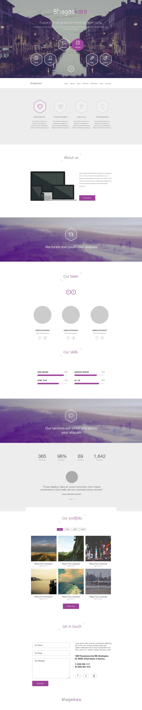

Welcome to my first RWD web page project! I got totally overexcited of this new way of building web pages and how many posibilities it gives. I worte tones of code (3k for SCSS, 0.5k for HTML and jQuery). I worte so smuch to be sure all will look super perfect on any screen you will look at it.

In this page i used two jquery plugins for responsive sliders (bxslider and slick). I used them to check what the differences are between them in terms od usability. I self-wrote gallery viewer mimicking fancybox. I didn't want to use any plugin here, just wanted to check my jquery abilities.

Page is fully responsive so hope you will enjoy checking it out! :)  
The outline of the project in PC monitor or laptop look like this: 

